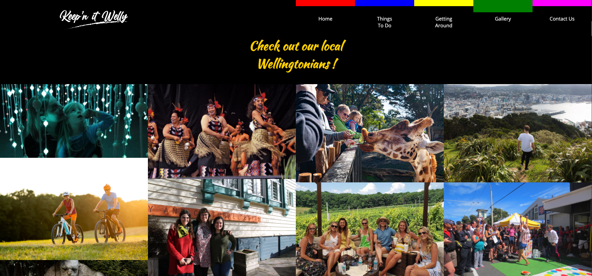
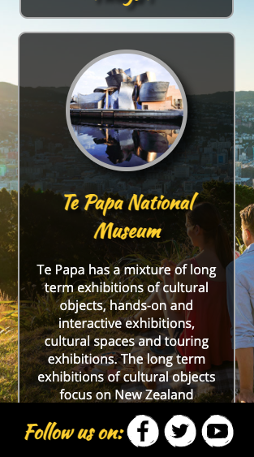

# Purpose of the project

This website is designed for the purpose firstly showcasing what Wellington City has to offer and secondly being a source of some essential information required to achieve a pleasant holiday / long weekend break.

# Features

## Navigation Bar

The nav menu allows the user to move through the website and also have a visual representation as to which page they are currently on without having to guess. I chose to keep the nav bar color coded with strong colors as it clearly shows the section the user is on against a dark background.

The nav bar consists of two variations to accomodate for large and small screen sizes.

- __Full Nav Bar__

  

- __Compressed Nav Bar__

  

## Footer

The footer bar holds social media links which when clicked on will take the user to “Keep’n it Welly” – Facebook, Twitter, YouTube or Instagram pages.

The icons were designed by myself using Adobe tool kit.

  

## Things To Do Page

In this section the user will be presented with some options on what to do in the city and also have additional useful links which will bring them to official sources of the desired activity. Each section is clearly divided to allow the user to focus on the info they are looking for without worrying about overflow info from another section.

  

## Getting Around Page

This page outlines info on how to navigate the city and displays some of the common transportation needs. Each section has links to external sources which are to help the user with some additional info for official sources. This section is also clearly split to help with keeping the user focused on the section and info the need.

  

## Gallery Page

I have implemented a gallery to showcase what a beautiful city Wellington is and potentially give the user inspiration to come and check out the city and surrounding areas.

  

## Contact Us Page

This page is for the user to provide a message and contact us for any additional requirements that they might have.

  

# Future Features

- I intend to design and implement a compressed version of this nav bar that stills allows the user to have a clear representation as to what section they are on. The version I would like to develop would only display a single badge with the color property for that page while still allowing the user to see the other options which would pull out from the side of the page when hovered on.

- On the “Home” page, I want to include a video display in the background to make the site more visually appealing.

- On the things to do page I would like to include an interactive map which will display areas in the city so that the user will have a visual indication as to the distance between popular destinations.

- I still intend to work and develop this site as I want to create a source for people to find out the necessary info for the city and then ultimately work on a website for tourists for the whole of New Zealand. This will be broken into two main sections of North and South islands and be a source of info and helpful tips for various users.

# Typography and Colour Scheme

The chosen style of the site is a clean display with strong contrast. I chose white on black for the text content as it stands out the most and is easy to read and then 100% strong vibrant colours for the navigation to clearly display where the user is on the website. The colour scheme was inspired from an iconic landmark in Wellington "The Bucket Fountain" which to me represents strong features with colors and display.

- __Font style inspiration:__

  

- __Colour style inspiration:__

  

# Wireframes

I chose balsamiq to create some wireframes and to knock out some ideas quickly.

- __Home:__

  

- __Things To Do:__

  

- __Getting Around:__

  

- __Contact Us:__

  

# Testing 

After having shown my project to a handful of people I got some valuable feedback which allowed me to redesign some features. The Navgation bar was the biggest concern as 2/3 of my testers indicated that knowing where they were currently was very important.

To use the feedback from te users I decided to increase the navigation tab area and make it stick to the top of the header section so that the text is naturally read second after the tab section is identified. The intention and purpose is to have the have the user eye natually trail from left to right and then top to bottom as this is more natural move.

The biggest issue I had was making the nav bar compatible on smaller screens and after trying and testing some ideas and going back to the drawing board I decided to break it apart and change the placement of it altogether. I ended up creating the DIV to take up 100% width of the nav and header section and adjust the placement of the text with margins to allow for a consistent placement for the five navigation tabs.

I used chrome dev tools to test and check all features of this site were working and displaying correctly. I chose two main screens sizes to work with in the beginning and then I started to make adjustments to the code by using the responsive tools in chrome to see how the site displayed in different screen orientations and widths.

With further development of this I will be able to make and incorporate this look into other areas of the site; for example different colour tags for "things to do"/"getting around" sections.

- __Original Navigantion Placement__

  

- __Home Page iPad__

  

- __Home Page iPhone__

  

- __Things To Do Page iPad__

  

- __Things To Do Page iPhone__

  

## Validator Testing 

### HTML

- No errors were found when passing through the official W3C Markup Validation for all the HTML and CSS pages within the website.

- __Home Page Validation__
  

- __Things To Do Page Validation__
  

- __Getting Around Page Validation__
  

- __Gallery Page Validation__
  

- __Contact-Us Page Validation__
  

- __CSS Validation__
  

## Deployment

I used GitHub pages to deploy the project and the steps I done are as follows: 

- The site was deployed to GitHub pages. The steps to deploy are as follows: 
  - Open GitHub project repository
  - Navigate to the Settings tab
  - Select pages from the menu on the left hand side
  - Within the source section I selected the Master Branch from the dop down menu.
  - This then provided me the link. 

The live link can be found here - https://ronan-o-murchu.github.io/keep-n-it-welly/

# Credits 

For this website I used many sources for the images and word content. The images were pulled from google images with reference to each one below and the majority of the word content was pulled from Wikipedia as well as others shown below.

## Code 

- The foundation of the gallery section code was from the "Love Running" Code Institute project.

- Research on how to fix minor general errors with the code was mainly done through W3Schools.

## Content 

- The text for the Home page was taken from:
    - https://www.newzealandnow.govt.nz/choose-new-zealand/regions-cities/wellington

- The text for the Things To Do page was taken from:
    - https://en.wikipedia.org/wiki/Museum_of_New_Zealand_Te_Papa_Tongarewa
    - https://en.wikipedia.org/wiki/Wellington_Botanic_Garden
    - https://en.wikipedia.org/wiki/Escarpment_Track
    - https://www.wetaworkshop.com/about-us/
    - https://en.wikipedia.org/wiki/Zealandia_(wildlife_sanctuary)

- The text for the Getting Around page was taken from:
    - https://www.flightcentre.co.nz/wellington/travel-guide/getting-around
    - https://en.wikipedia.org/wiki/Public_transport_in_the_Wellington_Region
    - https://en.wikipedia.org/wiki/Public_transport_in_the_Wellington_Region
    - https://www.nz.kayak.com/New-Zealand-Car-hire.177.crc.html#:~:text=To%20legally%20rent%20a%20car,when%20renting%20in%20New%20Zealand
    - https://en.wikipedia.org/wiki/Wellington_Airport

## Media

- The photos used on the Home page is from:
    - https://images.squarespace-cdn.com/content/v1/5c3bf5b9a9e028aedaf40d87/1555993269542-X97C9V94FHJ2W1ZWNAKE/ke17ZwdGBToddI8pDm48kDDckFQ-QCnd8Bdji_NBlmMUqsxRUqqbr1mOJYKfIPR7LoDQ9mXPOjoJoqy81S2I8N_N4V1vUb5AoIIIbLZhVYy7Mythp_T-mtop-vrsUOmeInPi9iDjx9w8K4ZfjXt2doULyzW0VOynvl1phfW7aW2h0TkPvSq5eU_FcXRF02duH3bqxw7fF48mhrq5Ulr0Hg/U103-Mount-Victoria-Wellington-Rob-Suisted.jpg?format=1500w

- The photos used on the Things To Do page is from:
    - https://upload.wikimedia.org/wikipedia/commons/b/b2/20170409_Zealandia_013-Pano.jpg
    - https://www.aucklandnz.com/sites/build_auckland/files/styles/carousel_banner/public/tourismnz/artist_shed_landscape_v1.jpg
    - https://i.pinimg.com/originals/60/25/95/6025950e63d4f2622ce81d1cf98598ad.jpg
    - https://www.downunderendeavours.com/wp-content/uploads/2014/08/wine-couple-having-picnic-7456-Mount-Victoria-Wellington-Julian-Apse.jpg
    - https://wilderness-production.imgix.net/2016/07/Paekakariki-Escarpment.web_.jpg?auto=compress%2Cformat&ixlib=php-1.2.1

- The photos used on the Getting Around page is from:
    - https://media-cldnry.s-nbcnews.com/image/upload/newscms/2019_13/2798361/190325-rental-cars-cs-229p-2798361.jpg
    - https://archipro.co.nz/assets/photos/wellington-airport-carpark-5-2.jpg?raw=1
    - https://www.railexpress.com.au/wp-content/uploads/2016/03/Metlink-train-in-Wellington-Photo-Creative-Commons-Simons27.jpg
    - https://resources.stuff.co.nz/content/dam/images/1/q/k/f/p/b/image.related.StuffLandscapeSixteenByNine.1420x800.1qjle8.png/1530232509571.jpg

- The photos used on the Gallery page is from:
    - https://wellingtonzoo.com/assets/Uploads/ShareImage/Wellington-Zoo-Giraffe-Feed-edited.jpg
    - https://i.pinimg.com/originals/5e/cb/17/5ecb17d84e16a2ba649922a5fc2b9438.jpg
    - https://main-cdn.grabone.co.nz/goimage/495x343/e0875da6a39bce56aa255513943245b051527058.jpg
    - https://assets.simpleviewinc.com/simpleview/image/fetch/q_60/https:/assets.simpleviewinc.com/simpleview/image/upload/crm/poconos/Group-Renegade-Wine-Tours-Pocono-Mtns0-503dc1bc04c2ae5_503dc2f5-e99c-9176-5d28b9557244687a.jpg
    - https://static.wixstatic.com/media/b8622a_424dab9729b240daa615b503952d55f3~mv2.jpg/v1/fill/w_2500,h_1785,al_c/b8622a_424dab9729b240daa615b503952d55f3~mv2.jpg
    - https://www.wfa.org.nz/assets/Get-involved/fe592d7afb/Get-Involved-Volunteer-Event-Medic.png
    - https://miro.medium.com/max/1838/1*4OAxboQKGJO7Tn4siMgKbQ.jpeg
    - https://www.totstoteens.co.nz/wp-content/uploads/2012/12/pexels-yan-krukov-5792901-scaled.jpg
    - https://cdn.eventfinda.co.nz/uploads/events/transformed/1538808-672239-14.jpg
    - https://www.wellingtonnz.com/assets/Weta-Workshop_credit-steve-unwin_film-studio-movies-cinema-tour_troll-family-picture-pose-troll-happy-smiling-tourists-visitors-outside-sculpture__FocusFillWzk2MCw1MzYsInkiLDUyXQ.jpg
    - https://www.wellingtonnz.com/assets/Elements/SingleImages/Expressions_people_artwork_mother_daughter_kids__FillWzEyMDAsNjAwXQ.jpg
    - https://www.gorentals.co.nz/images/locations/WLG_Explore.jpg
    - https://www.newzealand.com/assets/Campaigns/FY-20-Campaigns/FY20-Brand-Welcome/GMW-Still-Assets/121-Wellington-City-Graeme-Murray__aWxvdmVrZWxseQo_FocalPointCropWzQyNyw2NDAsNTAsNTAsODUsImpwZyIsNjUsMi41XQ.jpg
    - https://shiftchangenz.files.wordpress.com/2019/10/timebank_group2.png
    - https://www.wasabi-solar.co.nz/uploads/1/2/5/9/125967088/img-2363-1_orig.jpg
    - https://www.parliament.nz/media/5509/2019-interns-at-parliament-2.jpg
    - https://cdn.britannica.com/02/94802-050-ABBF25E0/Maori-kapa-haka-Wellington-New-Zealand.jpg

- The photos used on the Contact Us page is from:
    - https://trs.co.nz/wp-content/uploads/2018/11/famous-bucket-fountain-cuba-street-wellington-north-island-new-zealand_hl7-1pyaqx_thumbnail-full01.png